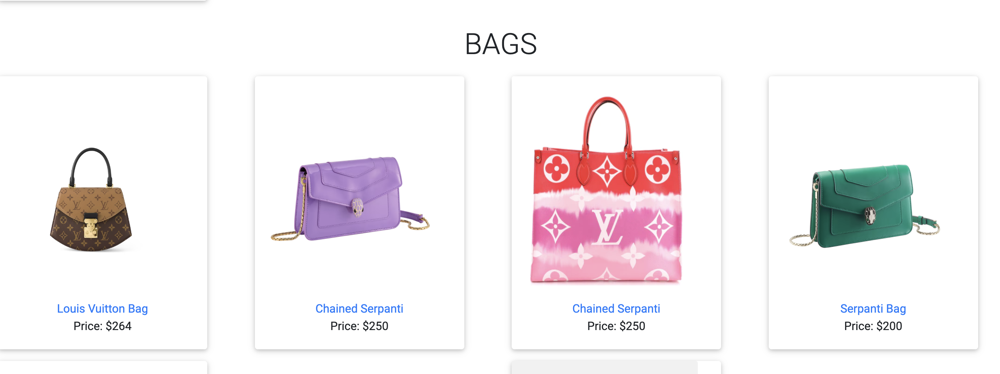

# ShopoHolic - Fashion Clothing App


## User Story
 We are a women's  clothing line which aims to provide clothing and accessories for women. Our users can view our products, add, reduce and delete items from the cart and place an order with us (Stripe Payment Gateway), upon payment they can download their payment receipt. Additionally, they can also view the earlier orders placed.

 We provide our company details and website info at our home page to create reliability.

 Our users need to sign in to add items to add items to the cart, they can then select sizes and add the item to the cart. We tend to provide a downloading option for deownloading their payment receipt. Past orders can also be accessed by the users in their order history.

 Functionality:

 - User
    -`Signup`, `Login`, `Logout`
    - `Search Functionality` by `style` or `color`

 - Place Order
    - `Select size`
    - `Add to Cart`, `Reduce Item from Cart`, `Delete Item form Cart` & `order total`
    - `Make payment`
	- `Stripe Payment Gateway`
    - `View Order History`
   

 - Payment Gateway
	- `Stripe API`
	- `Download E-receipt`
		- `jspdf`, `html2canvas`

 - Footer Links
    - `Contact Details`, `Links`

 - Bonus
    - `ChatBot - Upcoming`

	

# Technologies Used

1. Java Script
2. Express.js
3. Node.js
4. Npm and its packages
    - `bcrypt`
    - `Stripe`
    - `html2canvas`
    - `jspdf`
    - `ReactPlayer`
    - `Cors`
	- `Kommunicate.io`
5. React.js
6. Stripe API (Payment Gateway) 
7. HTML/ CSS


# Wireframes

1. Home Page


2. Products Page



3. User Cart 


4. Payment Gateway


5. Payment Receipt


6. Order History


# Entity Relationship Diagram


# Routes

#### Users

| **URL**          | **HTTP Verb**|**Action**|
|------------------|--------------|----------|
| /users/signup    | GET         | new  
| /users/signup    | POST         | create  
| /users/login     | GET         | login       
| /users/login     | POST         | create       
| /users/logout    | DELETE       | destroy   

#### Menu

| **URL**            | **HTTP Verb**|**Action**|
|--------------------|--------------|----------|
| /menu              | GET          | index    |
| /menu/aboutus      | GET          | show     |


#### CART

| **URL**                               | **HTTP Verb**|**Action**                              |
|---------------------------------------|--------------|----------------------------------------|
| /cart/                                | GET          | All Cart Index
| /show/:cartId                         | GET          | Current Cart in use    
| /cart/:menuId                         | GET / POST   | Push items - in existing or Create Cart  
| /cart/:userid                         | GET          | Show Active Cart
| /cart/:userId/:itemId                 | POST         | Create / Push Item
| /cart/remove/:userId/:cartId/:itemId  | PATCH        | Remove 1 item  
| /cart/:userId/:cartId/:itemId         | PATCH        | Remove all Items having same Id from Cart

# Models
1. User
```.js
const UserSchema = new Schema(
	{
		username: { 
			type: String, 
			required: true, 
			unique: true 
		},
		password: { 
			type: String, 
			required: true 
		},
		email: {
			type: String, 
			required: true 
		}
	},
	{ timestamps: true }
)
```

2. Item

```.js
const itemSchema = new Schema(
	{
		style: { 
			type: String, 
			required: true 
		},
		size: [
            String
        ],
		img:{
        	type: String
    	},
        price: {
			 type: Number,
			required: true 
		},
		title: { 
			type: String, 
			required: true 
		},
        color: { 
			type: String, 
			required: true 
		},
		
	},
	{ timestamps: true }
)

```


3. Cart

```.js


const cartSchema = new Schema ({

    products:[
        {type: Schema.Types.ObjectId,
        ref: 'Item'} 
    ],
    owner: {
        type: Schema.Types.ObjectId,
        ref: 'User',
        required: true
    },
    active: {
        type: Boolean,
        default: true
    }
    
},{
    timestamps: true,
    toObject: { virtuals: true },
    toJSON: { virtuals: true }
}
)

```
